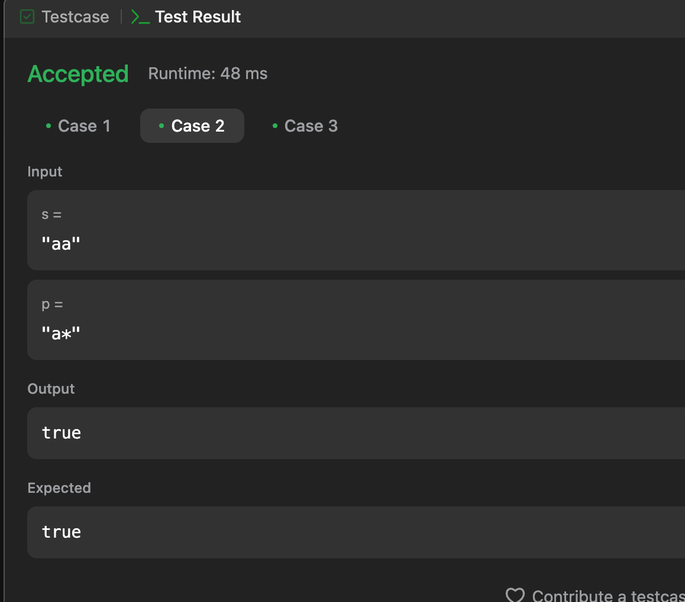
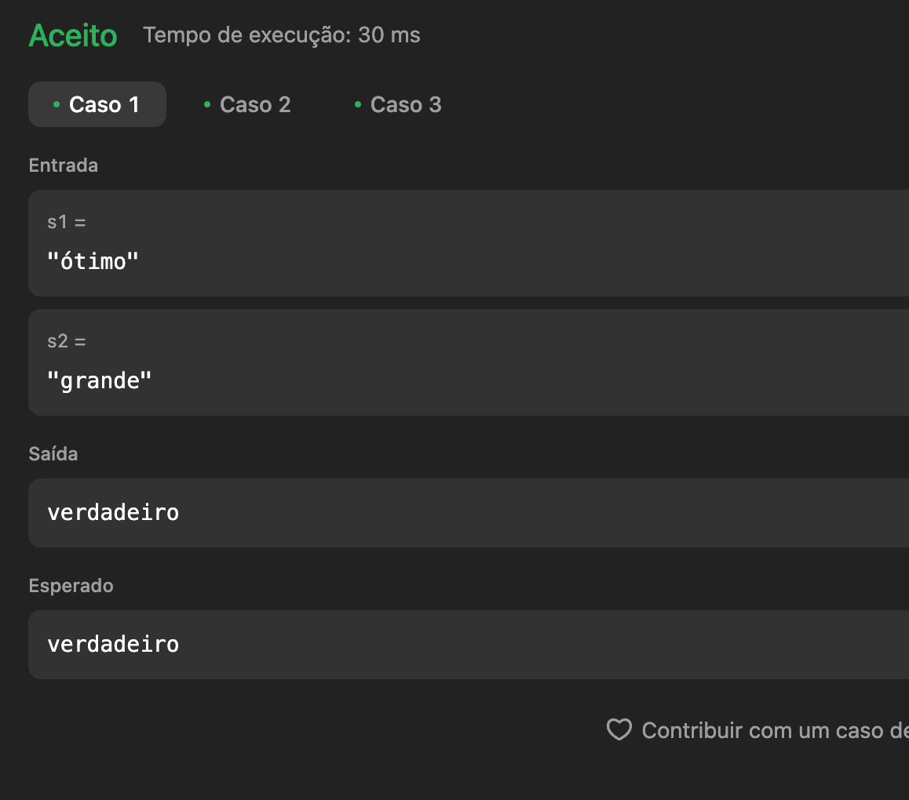

# Execícios do Leetcode

**Número da Lista**: 5<br>

**Conteúdo da Disciplina**: Programação Dinâmica<br>

## Alunos

- Dupla 6

| Matrícula | Aluno                             |
| --------- | --------------------------------- |
| 211061832 | Harleny Angéllica Araújo de Sousa |
| 211061331 | Alana Gabriele Amorim Silva       |

## Sobre

Este projeto tem como objetivo resolver questões do [LeetCode](https://leetcode.com/problemset/?search=graph&page=1&sorting=W3t9XQ%3D%3D) sobre dividir e conquistar utilizando a linguagem de programação Python. Abaixo, estão listadas as questões selecionadas, com seus respectivos níveis de dificuldade e vídeos explicativos da resolução.

## Questões

| Nome                                                                                                                                                  | Nível   |
| ----------------------------------------------------------------------------------------------------------------------------------------------------- | ------- |
| [115. Distinct Subsequences](https://leetcode.com/problems/distinct-subsequences/description/?envType=problem-list-v2&envId=dynamic-programming)      | Difícil |
| [10. Regular Expression Matching](https://leetcode.com/problems/distinct-subsequences/description/?envType=problem-list-v2&envId=dynamic-programming) | Difícil |
| [87. Scramble String](https://leetcode.com/problems/scramble-string/description/?envType=problem-list-v2&envId=dynamic-programming)                   | Difícil |

## Vídeo

[Vídeo aqui]()

## Screenshots

### [115. Distinct Subsequences](https://leetcode.com/problems/distinct-subsequences/description/?envType=problem-list-v2&envId=dynamic-programming) 

 **Caso 1:**


 **Caso 2:**


### [10. Regular Expression Matching](https://leetcode.com/problems/distinct-subsequences/description/?envType=problem-list-v2&envId=dynamic-programming)

**Caso 1:**

<br>

**Caso 2:**

<br>

### [87. Scramble String](https://leetcode.com/problems/scramble-string/description/?envType=problem-list-v2&envId=dynamic-programming)

**Caso 1:**

<br>

**Linguagem**: Python3 <br>

- Necessário ter o Python instalado.

## Uso

```

python3 "nome-do-arquivo"

```

## Outros

Quaisquer outras informações sobre seu projeto podem ser descritas abaixo.
